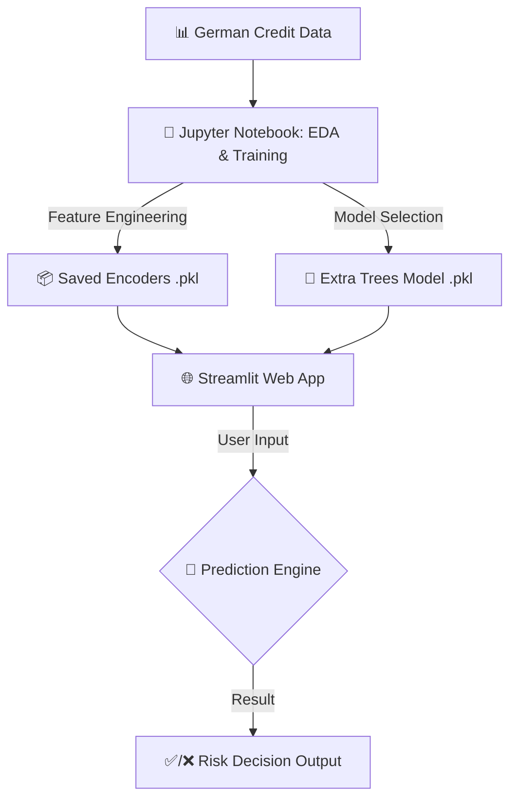

<div align="center">

<br />
  <h1>💰 Credit Risk Predictor: End-to-End ML Pipeline</h1>
  <p><strong>Predictive Modeling & Real-Time Decision Interface</strong></p>

<p>
  <a href="https://credit-risk-model-brdvrp5bbgmdfjtxnyzgcs.streamlit.app/" target="_blank">
    
  </a>

  <a href="https://github.com/thayss-tech" target="_blank">
    
  </a>
</p>

<p>
  <a href="https://pandas.pydata.org/" target="_blank">
    
  </a>

  <a href="https://scikit-learn.org/" target="_blank">
    
  </a>

  <a href="https://xgboost.readthedocs.io/" target="_blank">
    
  </a>

  <a href="https://streamlit.io/" target="_blank">
    
  </a>
</p>

</div>

---

## 📑 Table of Contents

| Section | Description |
| :--- | :--- |
| [**💡 Overview**](#overview) | Project mission and business context. |
| [**📈 Business Impact**](#business-impact) | The real-world value of this predictive model. |
| [**🏗️ Architecture**](#architecture) | Technical flow from Data to Live Prediction. |
| [**🧪 Modeling Strategy**](#modeling-strategy) | Algorithm tournament and optimization logic. |
| [**⚙️ Technical Engine**](#technical-engine) | Breakdown of the production-ready assets. |
| [**🗺️ Repository Map**](#repository-map) | Directory tree visualization. |
| [**🎮 How to Use the App**](#how-to-use) | A quick guide for everyday users. |
| [**🚀 Deployment**](#deployment) | Live access information. |
| [**📩 Contact**](#contact) | Professional links. |

---

## <a id="overview"></a>💡 Overview

Assessing credit risk is a cornerstone of retail banking. This project implements a supervised machine learning solution to predict whether a borrower represents a **'Good'** or **'Bad'** credit risk using the German Credit Dataset.

The core development objective is to provide a **conservative risk evaluation tool** that prioritizes data certainty (Complete-Case Analysis) to minimize potential bank defaults while maintaining a streamlined approval process.

> 🧑‍💻 **Curious about the technical deep dive?** > I highly encourage you to check out the **[`analysis_model.ipynb`](analysis_model.ipynb)** notebook! Inside, you will find the complete behind-the-scenes journey: from the Exploratory Data Analysis (EDA) and rigorous data cleaning, to the exact rationale behind every feature engineering decision and the comprehensive model tournament.

---

## <a id="business-impact"></a>📈 Business Impact

By transitioning from basic human interpretation or simple heuristic models to this Extra Trees classifier, the system **increases predictive capability by nearly 10 percentage points**. 

In a real-world retail banking scenario, a 10% increase in accurately identifying credit risk translates directly into **millions of dollars saved** from avoided defaults, while safely expanding the portfolio of reliable borrowers.

---

## <a id="architecture"></a>🏗️ Architectural Model

The system is designed as a modular pipeline that connects exploratory data science with a production-grade interface.

### Operational Flow



#### Engineering Principles

  * **⚡ Efficiency:** Minimalist feature set (9 key predictors including Age, Purpose, Housing, and Account Details) for fast real-time inference.
  * **🛡️ Robustness:** Strict handling of categorical variables through persistent LabelEncoders exported via `joblib`.
  * **📊 Transparency:** Probability-based outputs (`predict_proba`) instead of simple binary classification.

---

## <a id="modeling-strategy"></a>🧪 Modeling Strategy

The analysis followed a rigorous methodology to identify the most stable classifier:

1.  **Data Quality:** Applied **Complete-Case Analysis**, focusing exclusively on fully verified financial profiles and discarding incomplete records (like missing core bank account data) to avoid unverified assumptions.
2.  **Imbalance Management:** Implemented `scale_pos_weight` and `class_weight='balanced'` to handle the natural scarcity of 'Bad Risk' cases in banking data.
3.  **Algorithm Tournament:** Evaluated multiple models including Decision Trees (58.1%), Random Forest (61.9%), and XGBoost (67.6%).
4.  **The Winner (Extra Trees):** Selected for its superior generalization capability (64.8% Accuracy) and stability across unseen data.
5.  **Hyperparameter Tuning:** Executed **GridSearchCV with 5-Fold Cross-Validation** to optimize depth, estimators, and split criteria.

---

## <a id="technical-engine"></a>⚙️ Technical Engine: `Production Assets`

The system relies on serialized components to ensure consistency between the training environment and the live app:

| Subsystem | Icon | Component | Purpose |
| :--- | :---: | :--- | :--- |
| **Model Core** | 🧠 | `extra_trees_credit_model.pkl` | The trained decision engine. |
| **Data Translation** | 🔠 | `*_encoder.pkl` | Persistent LabelEncoders for all categorical features. |
| **Interface Layer** | 💻 | `app.py` | Streamlit logic and UI handling. |
| **Dependency Map** | 📋 | `requirements.txt` | Environment specification for cloud deployment. |

---

## <a id="repository-map"></a>🗺️ Repository Map

```text
CREDIT RISK MODEL FINAL/
 ┃
 ┣ 📄 analysis_model.ipynb         # Main notebook: EDA, data cleaning, model training and evaluation
 ┣ 📄 app.py                       # Source code of the web interface built with Streamlit
 ┣ 📦 extra_trees_credit_model.pkl # Best-performing model (Extra Trees) trained and serialized
 ┃
 ┣ 📄 Checking_account_encoder.pkl # Exported dictionary to encode checking account status
 ┣ 📄 Housing_encoder.pkl          # Exported dictionary to encode housing status
 ┣ 📄 Saving_accounts_encoder.pkl  # Exported dictionary to encode savings account status
 ┣ 📄 Sex_encoder.pkl              # Exported dictionary to encode the 'Sex' variable into numeric format
 ┣ 📄 target_encoder.pkl           # Exported dictionary to encode the target variable (Risk)
 ┃
 ┣ 📊 german_credit_data.csv       # Original (raw) dataset containing financial records
 ┣ 📊 german_credit_data_clean.csv # Processed/cleaned dataset after Complete-Case Analysis
 ┃
 ┣ 📋 requirements.txt             # Python dependencies required for cloud deployment
 ┗ 📄 README.md                    # Technical and business documentation of the project (this file)
```

---

## <a id="how-to-use"></a>🎮 How to Use the App

You don't need to be a data scientist to use this tool! Here is how you can evaluate a credit profile in seconds:

1. **Open the Web App:** Click on the [Live App link](#deployment) below.
2. **Enter Applicant Data (Left Sidebar):** Navigate to the **"Applicant Data"** menu on the left side of the screen. Use the intuitive sliders and dropdown menus to input the client's financial and demographic details (e.g., Age, Sex, Job, Credit Amount, Account balances).
3. **View the Assessment (Main Panel):** As you input the data, the main dashboard will process the profile and instantly display the Risk Assessment verdict: either a **Good Risk ✅** or a **Bad Risk ❌**.
4. **Check the Confidence Level:** Right below the verdict, you will see a progress bar indicating the exact **Confidence Level** (e.g., 87.00%), showing exactly how certain the AI model is about its decision.

---

## <a id="deployment"></a>🚀 Deployment

The predictive engine is deployed via **Streamlit Community Cloud**, utilizing:

  * **Encrypted HTTPS communication.**
  * **Automated resource caching (`@st.cache_resource`)** for instant model loading.
  * **Continuous Deployment** directly from the GitHub repository.

| Type | Link |
| :--- | :--- |
| **🌐 Live App** | [https://credit-risk-model-brdvrp5bbgmdfjtxnyzgcs.streamlit.app/](https://credit-risk-model-brdvrp5bbgmdfjtxnyzgcs.streamlit.app/) |

---

## <a id="contact"></a>📩 Contact

<div align="center">

| Platform | Profile | Action |
| :--- | :--- | :--- |
| **LinkedIn** | Milton Mamani | [View Profile](https://www.linkedin.com/in/milton-mamani-1369a537b) |
| **GitHub** | thayss-tech | [Explore Repos](https://github.com/thayss-tech) |

<br />

> *Engineered with precision as a structured technical gateway for risk-sensitive environments.*

</div>
