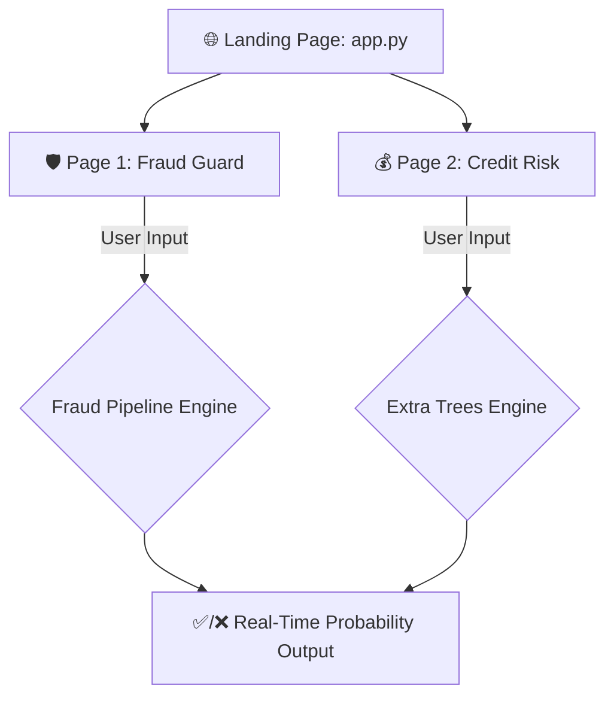

<div align="center">
  <br />
  <h1>🚀 AI Financial Solutions Hub: End-to-End ML Portfolio</h1>
  <p><strong>Centralized Multi-Page Architecture & Real-Time Decision Interfaces</strong></p>
  
  <p>
    <a href="https://ml-deployment-web-app-sdxdukod5bdlv2hqogitqz.streamlit.app/" target="_blank">
      
    </a>
    <a href="https://github.com/thayss-tech" target="_blank">
      
    </a>
  </p>
  
  <p>
    <a href="https://pandas.pydata.org/" target="_blank">
      
    </a>
    <a href="https://scikit-learn.org/" target="_blank">
      
    </a>
    <a href="https://streamlit.io/" target="_blank">
      
    </a>
  </p>
</div>

---

## 📑 Table of Contents

| Section | Description |
| :--- | :--- |
| [**💡 Overview**](#overview) | Project mission and business context. |
| [**📈 Business Impact**](#business-impact) | The real-world value of this centralized hub. |
| [**🏗️ Architecture**](#architecture) | Technical flow of the multi-page application. |
| [**🧪 Modeling Strategy**](#modeling-strategy) | Algorithmic approaches for fraud and credit risk. |
| [**⚙️ Technical Engine**](#technical-engine) | Breakdown of the production-ready assets. |
| [**🗺️ Repository Map**](#repository-map) | Directory tree visualization. |
| [**🎮 How to Use the App**](#how-to-use) | A quick guide for everyday users. |
| [**🚀 Deployment**](#deployment) | Live access information. |
| [**📩 Contact**](#contact) | Professional links. |

---

## <a id="overview"></a>💡 Overview

The **AI Financial Solutions Hub** is a centralized, multi-page web application designed to deploy and showcase enterprise-level Machine Learning models for the financial sector. Built with Streamlit, this hub serves as an interactive portfolio demonstrating end-to-end data science capabilities.

The core development objective is to provide a single, scalable access point for specialized predictive tools, currently featuring:

1. **🛡️ Fraud Guard:** A robust classification pipeline engineered to detect fraudulent activities in mobile money transactions.
2. **💰 Credit Risk Predictor:** A conservative evaluation tool to predict whether a retail banking applicant represents a 'Good' or 'Bad' credit risk.

> 🧑‍💻 **Curious about the technical deep dive?** > The original exploratory data analysis (EDA), rigorous data cleaning, and model tournaments for both applications were developed in dedicated Jupyter Notebooks prior to this deployment phase.

---

## <a id="business-impact"></a>📈 Business Impact

By centralizing these predictive engines into a single accessible interface, the system directly addresses two major pillars of financial stability:

* **Loss Prevention:** The Fraud Guard identifies high-risk transactions in real-time despite extreme class imbalances (0.3% baseline), stopping financial bleeding instantly.
* **Portfolio Health:** The Credit Risk Predictor increases predictive capability by nearly 10 percentage points over basic heuristic models, translating directly into millions of dollars saved from avoided bank defaults.

---

## <a id="architecture"></a>🏗️ Architectural Model

The system is designed as a modular, multi-page pipeline that connects pre-trained exploratory data science models with a unified production-grade interface.

### Operational Flow



#### Engineering Principles

* **⚡ Scalability:** Multi-page routing (`pages/` directory) allows for the seamless addition of future ML models without rewriting the core application.
* **🛡️ Robustness:** Strict handling of user inputs through persistent serialization (`.pkl` pipelines and encoders) via `joblib`.
* **📊 UI/UX Consistency:** Blinded CSS architecture to ensure responsive and professional rendering across different devices and system themes (Dark/Light mode).

---

## <a id="modeling-strategy"></a>🧪 Modeling Strategy

This hub unites two distinct and rigorous modeling methodologies:

* **Extreme Imbalance Management (Fraud):** Deployed a comprehensive Scikit-Learn Pipeline utilizing advanced algorithmic weighting (`scale_pos_weight`) to detect extreme minority cases (fraud) without sacrificing precision.
* **Conservative Risk Assessment (Credit):** Applied Complete-Case Analysis to prioritize data certainty. Evaluated multiple models (Decision Trees, Random Forest, XGBoost), ultimately selecting an Extra Trees Classifier for its superior generalization capability (64.8% Accuracy) and stability across unseen data.
* **Probability Thresholding:** Both models rely on `predict_proba()` to output exact confidence levels, providing nuanced insights rather than simple binary classifications.

---

## <a id="technical-engine"></a>⚙️ Technical Engine: Production Assets

The system relies on serialized components to ensure consistency between the training environments and the live cloud app:

| Subsystem | Icon | Component | Purpose |
| :--- | :---: | :--- | :--- |
| **Hub UI** | 💻 | `app.py` & `pages/` | Streamlit multi-page logic and front-end routing. |
| **Fraud Core** | 🧠 | `fraud_detection_pipeline.pkl` | Serialized Fraud Pipeline (Preprocessors + Model). |
| **Credit Core** | 🧠 | `extra_trees_credit_model.pkl` | The trained Extra Trees decision engine. |
| **Data Translation** | 🔠 | `*_encoder.pkl` | Persistent LabelEncoders for categorical banking features. |
| **Dependency Map** | 📋 | `requirements.txt` | Unified environment specification for cloud deployment. |

---

## <a id="repository-map"></a>🗺️ Repository Map

```text
ML-Deployment-Hub/
 ┣ 📄 app.py                           # Main landing page and UI CSS configuration
 ┣ 📂 pages/                           # Streamlit multi-page directory
 ┃ ┣ 📄 1_🛡️_Fraud_Guard.py           # Fraud detection app logic
 ┃ ┗ 📄 2_💰_Credit_Risk.py            # Credit risk evaluation app logic
 ┣ 📦 fraud_detection_pipeline.pkl     # Serialized Fraud Pipeline
 ┣ 📦 extra_trees_credit_model.pkl     # Serialized Credit Risk Model
 ┣ 📦 Checking_account_encoder.pkl     # Exported dictionary for checking account status
 ┣ 📦 Housing_encoder.pkl              # Exported dictionary for housing status
 ┣ 📦 Saving_accounts_encoder.pkl      # Exported dictionary for savings account status
 ┣ 📦 Sex_encoder.pkl                  # Exported dictionary for the 'Sex' variable
 ┣ 🖼️ logo c.png                       # UI Branding assets
 ┣ 📋 requirements.txt                 # Python dependencies required for cloud deployment
 ┗ 📄 README.md                        # Technical and business documentation (this file)
```

---

## <a id="how-to-use"></a>🎮 How to Use the App

You don't need to be a data scientist to use this tool! Here is how you can access the models:

1. **Open the Web App:** Click on the Live App link below.
2. **Navigate the Hub:** Use the left sidebar to select the predictive application you wish to test (Fraud Guard or Credit Risk).
3. **Enter Data:** Use the intuitive sliders, dropdown menus, and number inputs on the sidebar to input the financial parameters.
4. **View the Assessment:** The main dashboard will process the profile in real-time and display the predictive verdict alongside a progress bar indicating the exact Confidence Level of the AI engine.

---

## <a id="deployment"></a>🚀 Deployment

The predictive ecosystem is deployed via Streamlit Community Cloud, utilizing:

* Encrypted HTTPS communication.
* Automated resource caching (`@st.cache_resource`) for instant model and encoder loading across pages.
* Continuous Deployment directly from the GitHub repository.

| Type | Link |
| :--- | :--- |
| **🌐 Live App** | [https://ml-deployment-web-app-sdxdukod5bdlv2hqogitqz.streamlit.app/](https://ml-deployment-web-app-sdxdukod5bdlv2hqogitqz.streamlit.app/) |

---

## <a id="contact"></a>📩 Contact

<div align="center">

| Platform | Profile | Action |
| :--- | :--- | :--- |
| **🌐 Portfolio** | My Personal Website | [Visit Website](https://thayss-tech.github.io/PROFESSIONAL-WEBSITE/) |
| **💼 LinkedIn** | Milton Mamani | [View Profile](https://www.linkedin.com/in/milton-mamani-1369a537b) |
| **💻 GitHub** | thayss-tech | [Explore Repos](https://github.com/thayss-tech) |
| **📧 Email** | Contact Me | [Send Message](mailto:miltonmau14@gmail.com) |

<br />

> *Engineered with precision as a structured technical gateway for risk-sensitive environments.*

</div>
